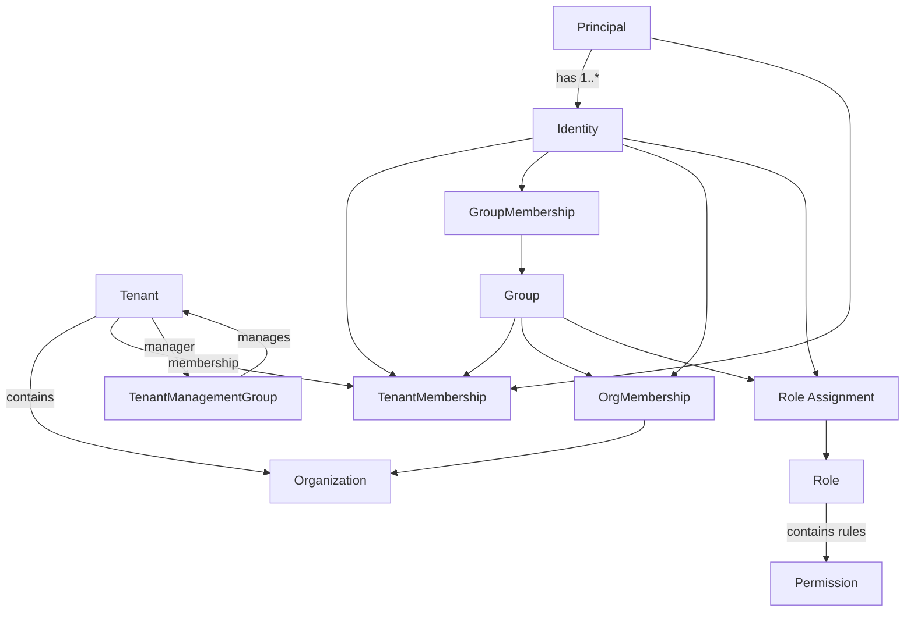

# MTMF Domain Model

## 1. Purpose

This document defines the structural domain model of the Multi-Tenant Management Framework (MTMF): domain objects, relationships, cardinalities, identity, lifecycle, and cross-object invariants.

Security semantics are normative in [SECURITY_MODEL.md](SECURITY_MODEL.md). Authorization evaluation is described in [AUTHORIZATION.md](AUTHORIZATION.md). Package and infrastructure boundaries are described in [ARCHITECTURE.md](ARCHITECTURE.md).

This document deliberately avoids prescribing PostgreSQL tables, repository interfaces, DTO shapes, or other implementation details unless they are required by a domain invariant.

Where a relationship remains unsettled, it is explicitly marked **UNRESOLVED**. Implementations MUST NOT silently convert an unresolved item into a permissive domain rule.

---

## 2. Domain Conventions

### 2.1 Stable identity and mutable names

Tenants, Organizations, and Groups have immutable, globally unique UUID identifiers.

Their names are mutable and non-unique. A name is presentation metadata and does not establish object identity.

Roles and Permissions use immutable, unique URNs as their canonical authorization identity. Their names and descriptions are mutable presentation metadata.

The exact identifier representation for Principal and Identity remains to be finalized; their identifiers MUST nevertheless be stable and MUST NOT be derived from mutable display names or external identity-provider labels.

### 2.2 Ownership

Where an MTMF object has ownership, its owner is the Identity that created it.

Ownership is immutable creator provenance. It is distinct from current administrative authority, Tenant Stewardship, Role assignment, and security scope.

### 2.3 Lifecycle

MTMF distinguishes at least:

```text
ACTIVE
INACTIVE
DELETED (soft-deleted)
```

where the state is relevant to a particular object type.

Soft deletion does not physically destroy object identity or security/audit provenance.

Activation and deactivation are explicit state transitions. Reactivating an inactive object does not restore a soft-deleted object.

Whether restoration of soft-deleted objects is supported remains **UNRESOLVED**.

The exact set of domain object types supporting ACTIVE/INACTIVE state remains **UNRESOLVED**.

### 2.4 Application extension data

The following domain objects expose an application-owned `extension` field:

- Tenant;
- Organization;
- Principal;
- Identity;
- Group;
- Role.

The field contains arbitrary valid JSON intended solely as a convenience for applications integrating with MTMF.

Conceptually:

```python
extension: dict[str, Any] | None
```

This Python form is illustrative; the public DTO representation is determined by `mtmf-api`.

MTMF stores and returns extension data but does not interpret its contents.

In particular, MTMF MUST NOT use extension contents to determine:

- identity;
- ownership;
- Tenant or Organization membership;
- Group membership;
- Role or Permission identity;
- security scope;
- authorization;
- Tenant Stewardship;
- TenantManagementGroup relationships;
- lifecycle state;
- any other MTMF-defined domain behavior.

Applications own the schema, semantics, and versioning of their extension data.

Permission does not expose this application extension field.

Extension mutation has dedicated authorization semantics defined by the security model.

---

## 3. Tenant

A Tenant is the primary tenancy and security boundary.

There is exactly one root Tenant created during bootstrap. The root Tenant has ROOT scope. All ordinary Tenants have TENANT scope.

A Tenant may contain:

- Organizations;
- Principals and their Identities;
- Groups;
- Tenant-defined Roles and Permissions;
- memberships and Role assignments applicable to that Tenant.

A Tenant has immutable ownership provenance through its creator Identity.

An active ordinary Tenant has exactly one active Tenant steward according to the security model.

---

## 4. Organization

An Organization belongs to exactly one Tenant.

Conceptually:

```text
Tenant 1 ---- * Organization
```

An Organization has immutable creator-Identity ownership.

The creator/owner Identity must automatically receive OrgMembership in the Organization. Organization creation and establishment of the owner's OrgMembership form one invariant-preserving operation.

Organizations do not currently define their own Roles or Permissions. Tenant-defined Roles may be assigned in an Organization context within their defining Tenant.

There is no Organization Stewardship domain concept.

---

## 5. Principal

A Principal represents the underlying account or actor represented by MTMF.

A Principal has one or more Identities:

```text
Principal 1 ---- 1..* Identity
```

Every Principal has exactly one mandatory MTMF-local, non-federated Identity and may have additional federated Identities.

A Principal belongs to a Tenant through the applicable TenantMembership semantics.

Authorization is not performed against the Principal as an aggregate of all its Identities. The specific acting Identity is security-significant.

Principal kinds such as human, service, or agent remain **UNRESOLVED**.

---

## 6. Identity

An Identity is a concrete identity associated with exactly one Principal.

Each Identity is tenant-bound consistently with its Principal and has the required TenantMembership semantics.

An Identity may:

- belong to zero or more Groups within its Tenant;
- belong to zero or more Organizations within its Tenant;
- receive zero or more direct Role assignments in valid assignment contexts;
- derive additional Roles from Groups to which it belongs.

Two Identities belonging to the same Principal do not implicitly share Group memberships, Role assignments, or authorization.

The exact external/federated identity representation is deferred to IdP design.

---

## 7. TenantMembership

Tenant membership is explicit domain state.

TenantMembership applies to Principal, Identity, and Group as required by the security model.

The following invariants hold:

- a tenant-bound Identity cannot exist outside its Tenant;
- a tenant-bound Group cannot exist outside its Tenant;
- every Identity of a Tenant Principal is bound to that same Tenant;
- Tenant-bound authorization relationships cannot cross Tenant boundaries.

The exact persistence/domain representation of the different member kinds—such as a polymorphic TenantMembership versus separate typed relationships—remains **UNRESOLVED**.

Tenant Stewardship belongs semantically to TenantMembership at the Principal level.

---

## 8. Group and GroupMembership

A Group is a tenant-bound collection of Identities.

A Group does not embed Identities directly. Membership is represented by GroupMembership:

```text
Identity * ---- * Group
          via GroupMembership
```

The Identity and Group in a GroupMembership must belong to the same Tenant.

A Group may receive multiple Role assignments. An Identity derives Roles from Groups of which that Identity is a member.

Nested Groups have not been specified and remain **UNRESOLVED**. They MUST NOT be assumed.

---

## 9. OrgMembership

OrgMembership represents explicit membership in an Organization.

The currently defined member kinds are:

- Identity;
- Group.

Conceptually:

```text
Identity * ---- * Organization
          via OrgMembership

Group    * ---- * Organization
          via OrgMembership
```

OrgMembership refines Tenant membership:

```text
OrgMembership(member, organization)
    implies
TenantMembership(member, organization.tenant)
```

Cross-Tenant OrgMembership is invalid.

Principal OrgMembership has not been specified and remains **UNRESOLVED**.

---

## 10. Role

A Role is a uniquely identified set of Permission rules.

A Role is defined in either the SYSTEM definition namespace or a TENANT definition namespace.

A SYSTEM Role is globally defined by MTMF. A TENANT Role belongs to exactly one defining Tenant.

Roles are assigned to:

- Identities;
- Groups.

Roles are not assigned directly to Principals.

Both Identity and Group relationships to Roles are many-to-many:

```text
Identity * ---- * Role
Group    * ---- * Role
```

Role assignment also has an authorization assignment context. The exact Role-assignment domain object and context representation remain **UNRESOLVED**.

A Role has:

- immutable, unique URN identity;
- mutable name;
- mutable description;
- application extension data when the Role is eligible for application extension usage.

For TENANT-defined Roles, the Tenant encoded in the URN and structural defining Tenant must agree.

---

## 11. Permission

A Permission is a uniquely identified authorization rule associated with an ALLOW or DENY effect and Action-matching semantics.

A Permission is defined in either the SYSTEM or TENANT definition namespace.

Permissions do not expose the application-owned `extension` field.

A Role may contain multiple Permission rules, and a Permission may participate in Role composition according to the eventual Role/Permission representation.

The exact persistence representation of Role-to-Permission composition remains an implementation/domain-design detail to be finalized.

Detailed matching semantics belong to [AUTHORIZATION.md](AUTHORIZATION.md).

---

## 12. Action

An Action is the exact operation requested against a resource.

Actions use:

```text
<resource>:<verb>-<qualifier>
```

An Action is distinct from a Permission. Permissions match Actions; callers request Actions.

The exact question of whether tenant-defined Actions are persisted first-class definitions or are validated request values following the grammar remains **UNRESOLVED**.

---

## 13. Role Assignment and Effective Roles

A Role assignment associates a Role with an Identity or Group in an applicable context.

For an Identity:

```text
EffectiveRoles(identity)
    =
    DirectRoles(identity)
    union
    GroupRoles(identity)
```

Role definitions and assignment contexts are distinct.

SYSTEM-defined Roles may be assigned in appropriate Tenant or Organization contexts. TENANT-defined Roles may be assigned only within their defining Tenant and its Organizations.

Role assignment must not create cross-Tenant authorization.

The exact assignment entity or entities remain **UNRESOLVED**.

---

## 14. Tenant Stewardship

Tenant Stewardship is a Tenant-only administrative concept.

It is not ownership, a Role, a Permission, or a security Scope.

For every active ordinary Tenant there is exactly one ACTIVE steward Principal.

The steward must satisfy the eligibility requirements in the security model, including Tenant membership, appropriate scope, active status, and Tenant Administrator Role requirements.

The root Tenant's steward is the root Principal and cannot be transferred.

Stewardship transfer does not alter immutable object ownership.

The exact acting Identity through which a steward Principal exercises stewardship-derived authority remains **UNRESOLVED**.

---

## 15. TenantManagementGroup

TenantManagementGroup represents delegated cross-Tenant administration and is distinct from the ordinary IAM Group.

Conceptually it has:

- one manager Tenant;
- a management Role;
- ROOT or SYSTEM management scope;
- a managed-Tenant relationship.

For the single bootstrap ROOT TenantManagementGroup:

```text
manager = root Tenant
scope   = ROOT
managed Tenants = all Tenants, implicitly
```

The ROOT management group does not materialize a managed-membership row for every Tenant.

For an ordinary management group:

```text
scope = SYSTEM
managed Tenants = explicit memberships
```

Contextual management scope does not mutate the intrinsic scope of the manager Tenant.

The exact persistence representation of TenantManagementGroup and its explicit managed-Tenant memberships remains **UNRESOLVED**.

The rule identifying which Identities or Groups in the manager Tenant may exercise the management Role remains **UNRESOLVED** and must fail closed until specified.

---

## 16. Extension Mutation

Extension data is application-owned rather than MTMF-owned state.

Mutation uses the dedicated Action family:

```text
tenant:update-extension
organization:update-extension
principal:update-extension
identity:update-extension
group:update-extension
role:update-extension
```

For an object owned by an ordinary Tenant, extension mutation can be authorized only through applicable TENANT-defined application authorization belonging to that same Tenant.

SYSTEM-defined MTMF Roles and Permissions do not grant an ordinary Tenant actor authority to mutate application extension data, even when a SYSTEM Permission wildcard would otherwise match `update-extension`.

The normal security model still applies independently. In particular, Tenant boundaries, assignment context, and scope dominance prevent a lesser-scoped Tenant from using its own application Role to modify extension data belonging to a dominant or different Tenant.

Extension authorization therefore does not introduce a parallel scope hierarchy.

---

## 17. Relationship Summary



The diagram is structural and intentionally omits security-evaluation details.

---

## 18. Atomic Invariant Boundaries

At minimum, the following operations must preserve their related invariants atomically where partial completion would produce invalid domain state:

- Organization creation and owner OrgMembership;
- Tenant Stewardship transfer;
- steward deactivation combined with replacement stewardship, if supported as one operation;
- creation or mutation of security relationships whose Tenant consistency must be validated;
- Role/Permission writes where structural Tenant ownership and URN Tenant ownership must agree.

Additional aggregate boundaries will be identified during detailed implementation planning.

---

## 19. Explicitly Unresolved Domain Questions

The following remain intentionally unsettled:

1. exact Principal and Identity identifier representation;
2. exact TenantMembership representation across Principal, Identity, and Group;
3. exact Role-assignment entity/entities and assignment-context representation;
4. which acting Identity of a steward Principal exercises stewardship authority;
5. which manager-Tenant Identities or Groups exercise TenantManagementGroup authority;
6. exact TenantManagementGroup persistence representation;
7. nested Group support;
8. Principal OrgMembership;
9. Principal kinds, including service and agent principals;
10. exact local/federated Identity representation;
11. complete active/inactive applicability and transition rules by object type;
12. whether soft-deleted objects can be restored;
13. whether tenant-defined Actions are persisted definitions or validated action values;
14. exact Role-to-Permission composition representation.

These questions should be resolved deliberately before schema or API choices depend on them.
