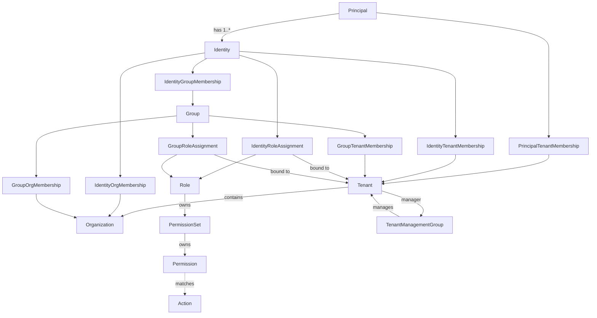

# MTMF Domain Model

## 1. Purpose

This document defines the structural domain model of the Multi-Tenant Management Framework (MTMF): domain objects, relationships, cardinalities, identity, lifecycle, and cross-object invariants.

Security semantics are normative in [SECURITY_MODEL.md](SECURITY_MODEL.md). Authorization evaluation is described in [AUTHORIZATION.md](AUTHORIZATION.md). Package and infrastructure boundaries are described in [ARCHITECTURE.md](ARCHITECTURE.md).

This document deliberately avoids prescribing PostgreSQL tables, repository interfaces, DTO shapes, or other implementation details unless they are required by a domain invariant.

Where a relationship remains unsettled, it is explicitly marked **UNRESOLVED**. Implementations MUST NOT silently convert an unresolved item into a permissive domain rule.

---

## 2. Domain Conventions

### 2.1 Stable identity and mutable names

Tenants, Organizations, Principals, Identities, Groups, PermissionSets, and Permissions have immutable, globally unique UUID object identifiers.

Their mutable names, where present, are presentation metadata and do not establish object identity.

Roles use immutable, unique URNs as their canonical authorization identity. Actions use immutable, globally unique URNs as their canonical identity.

A Permission has both a UUID object identity and a Permission URN describing its Action-matching expression. A Permission URN is not the Permission object's identity and is not required to be globally unique: multiple owned Permission instances may express the same matcher.

Domain objects are mutable where the domain permits mutation. Identity and provenance fields—including UUID identity, immutable Role and Action URNs, and creator ownership—MUST NOT be mutated after creation.

### 2.2 Ownership

Where an MTMF object has ownership, its owner is the Identity that created it.

Ownership is immutable creator provenance. It is distinct from current administrative authority, Tenant Stewardship, Role assignment, and security scope.

### 2.3 Lifecycle

For domain entities, soft deletion is represented independently from active/inactive state. Typed membership relationships instead use physical deletion (Section 7):

```python
class DeletionStatus(IntEnum):
    DELETED = 1
    NOT_DELETED = 2

class ActiveStatus(IntEnum):
    INACTIVE = 0
    ACTIVE = 1
```

The corresponding domain fields are `deletion_status: DeletionStatus` and, where active/inactive lifecycle applies, `active_status: ActiveStatus`.

The `DeletionStatus` numeric values are enum values, not Boolean semantics; implementations MUST NOT infer deletion through truthiness.

Soft deletion does not physically destroy object identity or security/audit provenance.

Activation and deactivation are explicit state transitions. Setting an object active does not restore a soft-deleted object.

Whether restoration of soft-deleted objects is supported remains **UNRESOLVED**.

For ordinary Tenants, PR 10 specifies explicit PROVISIONING, ACTIVE and SUSPENDED states; only ACTIVE supports ordinary Tenant sessions. The root Tenant is ACTIVE and cannot be suspended. The exact active/inactive applicability for **other** domain object types remains **UNRESOLVED**. See [PR 10 Architecture Decisions](PR10_ARCHITECTURE_DECISIONS.md).

### 2.4 Application extension data

The following domain objects expose an application-owned `extension` field:

- Tenant;
- Organization;
- Principal;
- Identity;
- Group;
- Role.

The field contains arbitrary valid JSON intended solely as a convenience for applications integrating with MTMF.

Conceptually:

```python
extension: dict[str, JsonValue] = field(default_factory=dict)
```

The extension value is always a JSON object. An empty object (`{}`) means that no application extension data is present; `None` / JSON `null` is not a valid domain representation. This Python form is illustrative; the public DTO representation is determined by `mtmf-api`.

MTMF stores and returns extension data but does not interpret its contents.

In particular, MTMF MUST NOT use extension contents to determine:

- identity;
- ownership;
- Tenant or Organization membership;
- Group membership;
- Role or Permission identity;
- security scope;
- authorization;
- Tenant Stewardship;
- TenantManagementGroup relationships;
- lifecycle state;
- any other MTMF-defined domain behavior.

Applications own the schema, semantics, and versioning of their extension data.

Permission does not expose this application extension field.

Extension mutation has dedicated authorization semantics defined by the security model.

---

## 3. Tenant

A Tenant is the primary tenancy and security boundary.

There is exactly one root Tenant created during bootstrap. The root Tenant has ROOT scope. All ordinary Tenants have TENANT scope.

A Tenant may contain or contextualize:

- Organizations;
- explicit memberships for global Principals and selected Identities;
- Groups;
- Tenant-defined Roles;
- memberships and Role assignments applicable to that Tenant.

Principal and Identity objects are global MTMF objects rather than objects owned by one Tenant.

A Tenant has immutable ownership provenance through its creator Identity.

An active ordinary Tenant has exactly one active Tenant steward according to the security model.

---

## 4. Organization

An Organization belongs to exactly one Tenant.

Conceptually:

```text
Tenant 1 ---- * Organization
```

An Organization has immutable creator-Identity ownership.

The creator/owner Identity must automatically receive OrganizationMembership in the Organization. Organization creation and establishment of the owner's OrganizationMembership form one invariant-preserving operation.

Organizations do not currently define their own Roles or Permissions. Tenant-defined Roles may be assigned in an Organization context within their defining Tenant.

There is no Organization Stewardship domain concept.

---

## 5. Principal

A Principal represents the underlying account or actor represented by MTMF.

A Principal has one or more Identities:

```text
Principal 1 ---- 1..* Identity
```

Every Principal has exactly one mandatory MTMF-local, non-federated Identity and may have additional federated Identities.

A Principal is global to MTMF and may belong to multiple Tenants through typed PrincipalTenantMembership relationships.

Different Tenants may expose different subsets of the Principal's Identities. The mandatory local Identity does not automatically become usable in every Tenant the Principal joins.

Authorization is not performed against the Principal as an aggregate of all its Identities. The specific acting Identity is security-significant.

Principal kinds such as human, service, or agent remain **UNRESOLVED**.

---

### Local Identity classification (PR 10)

An Identity has an explicit origin classification, LOCAL or FEDERATED. The classification is not inferred from names, UUIDs or the existence of credentials. Legacy unknown-origin Identities require verified classification before satisfying root-local continuity; they must not be defaulted to LOCAL. This is a domain attribute, not an authentication implementation. See [PR 10 Architecture Decisions](PR10_ARCHITECTURE_DECISIONS.md).

## 6. Identity

An Identity is a concrete identity associated with exactly one Principal.

An Identity is global to MTMF. Its usability in a Tenant is explicit through IdentityTenantMembership and is independent of the Principal's other Identities.

An Identity may:

- be usable in zero or more Tenants in which its Principal is a member;
- belong to zero or more Groups within an applicable Tenant;
- belong to zero or more Organizations within an applicable Tenant;
- receive zero or more direct Role assignments in valid Tenant contexts;
- derive additional Roles from Groups to which it belongs.

Two Identities belonging to the same Principal do not implicitly share Group memberships, Role assignments, or authorization.

The exact external/federated identity representation is deferred to IdP design.

---

## 7. Typed Tenant Memberships

Tenant membership is explicit, typed domain state. MTMF does not use a polymorphic `member_type/member_id` TenantMembership relationship.

The model includes distinct relationships for the applicable member kinds, including:

- PrincipalTenantMembership;
- IdentityTenantMembership;
- GroupTenantMembership.

A Principal may have PrincipalTenantMembership in multiple Tenants. An Identity may have IdentityTenantMembership in a subset of the Tenants in which its Principal is a member. Identity membership in Tenant T requires the Identity's Principal to have valid PrincipalTenantMembership in T.

A Group is exclusive to exactly one Tenant and has GroupTenantMembership in that Tenant only. The same Group MUST NOT have GroupTenantMembership in another Tenant, including concurrently active memberships.

### Membership removal and dependent-state cascade

Typed membership relationships are current-state facts, not soft-deletable domain entities. Removing a membership MUST physically delete its row. Removal of a prerequisite membership MUST atomically hard-delete every dependent membership in the affected Tenant:

1. Removing `PrincipalTenantMembership(P, T)` removes every `IdentityTenantMembership(I, T)` where Identity `I` belongs to Principal `P`. Each removed Identity-Tenant membership also triggers the dependent removals in rule 2.
2. Removing `IdentityTenantMembership(I, T)` removes every `IdentityOrgMembership(I, O)` where Organization `O` belongs to Tenant `T`, and every `IdentityGroupMembership(I, G)` where Group `G` belongs exclusively to `T`.
3. Removing `GroupTenantMembership(G, T)` removes every `GroupOrgMembership(G, O)` where Organization `O` belongs to `T`, and every `IdentityGroupMembership(I, G)` for that Group.

A membership outside the affected Tenant MUST remain unchanged. No dependent membership row may remain after its prerequisite membership is removed. Cascades MUST be enforced at the trusted persistence/write boundary in one transaction; callers MUST NOT be required to perform dependent removals individually. Removal of a Group-Tenant membership does not, by itself, remove any Identity-Tenant membership.

Role assignments are **not** membership rows and are never silently
cascade-deleted. A Role assignment references its prerequisite membership
restrictively: removing a prerequisite membership while a dependent
assignment exists is rejected deterministically (and the whole removal,
including any membership cascade and its audit, rolls back). The caller must
revoke the assignment explicitly first.

Membership rows have no deletion-status or activation-status lifecycle. Rejoining requires an explicit new membership insertion; it MUST NOT automatically recreate previously removed Organization or Group memberships. Domain-entity soft-deletion and unresolved entity-restoration policy are separate concerns.

### Membership removal audit

Each initiating membership-removal operation MUST write **one compact operation-level audit record**, atomically with the hard deletion and its entire cascade. The record MUST identify the initiating typed relationship and its participants (and Tenant context), operation timestamp, actor Identity when available, and aggregate counts of physically removed memberships **by membership type** (including the initiating membership in its corresponding count). Audit records MUST NOT enumerate or embed all affected identities, groups, organizations, or dependent memberships; MUST NOT emit one audit event per cascaded membership; and MUST NOT be treated as a complete historical membership ledger. The counts MUST reflect actual deleted rows, not estimates. A failed or rolled-back removal MUST leave neither committed deletions nor a committed audit record. An unauthorized or protected removal MUST be rejected before mutation; an unavailable actor is represented explicitly rather than fabricated. Audit data is retained independently of current membership rows and is not a source of authorization membership.

Tenant-bound authorization relationships MUST NOT cross Tenant boundaries.

Tenant Stewardship belongs semantically to PrincipalTenantMembership.

Authentication establishes a session context:

```text
Session = (Tenant, Principal, Identity)
```

A valid session requires:

1. the Identity belongs to the Principal;
2. the Principal has valid active PrincipalTenantMembership in the Tenant;
3. the Identity has valid active IdentityTenantMembership in the Tenant.

Authorization considers only memberships, Groups, Organizations, Role assignments, and other authorization state applicable to the session Tenant. Authorization state from another Tenant MUST NOT be unioned into the current session.

Switching Tenant context requires authorization context to be re-evaluated; authorization state MUST NOT carry over implicitly.

---

## 8. Group and IdentityGroupMembership

A Group is a tenant-bound collection of Identities.

A Group does not embed Identities directly. Membership is represented by IdentityGroupMembership:

```text
Identity * ---- * Group
          via IdentityGroupMembership
```

The Identity and Group in a IdentityGroupMembership must belong to the same Tenant.

A Group may receive multiple Role assignments. An Identity derives Roles from Groups of which that Identity is a member.

Nested Groups have not been specified and remain **UNRESOLVED**. They MUST NOT be assumed.

---

## 9. Typed Organization Memberships

OrganizationMembership represents explicit membership in an Organization.

Organization membership is typed. The currently defined relationships are:

- IdentityOrgMembership;
- GroupOrgMembership.

A polymorphic Organization membership relationship is not used.

Conceptually:

```text
Identity * ---- * Organization
          via IdentityOrgMembership

Group    * ---- * Organization
          via GroupOrgMembership
```

Each typed Organization membership refines the corresponding Tenant membership. The member must already be valid in the Organization's containing Tenant.

Cross-Tenant Organization membership is invalid.

Principal Organization membership has not been specified and remains **UNRESOLVED**.

---

## 10. Role

A Role is a uniquely identified policy composed of owned PermissionSets.

A Role is defined in either the SYSTEM definition namespace or a TENANT definition namespace.

A SYSTEM Role is globally defined by MTMF. A TENANT Role belongs to exactly one defining Tenant.

Roles are assigned to:

- Identities;
- Groups.

Roles are not assigned directly to Principals.

Both Identity and Group relationships to Roles are many-to-many:

```text
Identity * ---- * Role
Group    * ---- * Role
```

Every Role assignment is Tenant-bound. An assignment associates a Role with an Identity or Group in exactly one Tenant context and may optionally refine that context to an Organization belonging to the same Tenant.

The assignment representation is two explicit typed entities,
`IdentityRoleAssignment` and `GroupRoleAssignment`; there is deliberately
no polymorphic `(subject_type, subject_id)` assignment. Each assignment has
an immutable UUID identity, an immutable structural `tenant_id`, an
immutable target (`identity_id` or `group_id`), an immutable `role_urn`, and
an optional immutable `organization_id` (`NULL` means Tenant-wide). There is
no mutable assignment state: revocation physically removes the row and a
later regrant uses a new UUID.

A Role has:

- immutable, unique URN identity;
- mutable name;
- mutable description;
- application extension data when the Role is eligible for application extension usage.

For TENANT-defined Roles, the Tenant encoded in the URN and structural defining Tenant must agree.

---

## 11. PermissionSet and Permission

A Role owns an ordered list of PermissionSets. A PermissionSet belongs to exactly one Role and is not shared between Roles.

A PermissionSet has:

- an immutable UUID object identity;
- an effect of `ALLOW` or `DENY`;
- an ordered list of owned Permissions.

A Permission belongs to exactly one PermissionSet and is not shared between PermissionSets or Roles.

A Permission has:

- an immutable UUID object identity;
- a Permission URN that expresses Action-matching semantics.

The Permission URN is not the Permission object's identity and is not required to be globally unique. Two Permission objects may carry the same Permission URN and are semantically equivalent matchers while remaining distinct owned domain objects.

A Permission has no independent effect. It inherits the effect of its containing PermissionSet.

Permission and PermissionSet list ordering is structural and MUST NOT imply authorization precedence.

A Permission URN may identify either an exact Action matcher or the constrained qualifier-wildcard matcher defined by the authorization model.

PermissionSets and Permissions are not independently assignable. Roles are the assignable policy objects.

Detailed matching and conflict-resolution semantics belong to [AUTHORIZATION.md](AUTHORIZATION.md).

---

## 12. Action

An Action is the exact operation requested against a resource.

Actions use:

```text
<resource>:<verb>-<qualifier>
```

An Action is distinct from a Permission. Permissions match Actions; callers request Actions.

Actions are shared definitions and are uniquely identified by immutable URNs. Action URNs always identify exact Actions; wildcard expressions exist only in Permission URNs.

---

## 13. Role Assignment and Effective Roles

A Role assignment associates a Role with an Identity or Group in an applicable context.

For a session Tenant and Identity:

```text
EffectiveRoles(identity, tenant)
    =
    DirectRoles(identity, tenant)
    union
    GroupRoles(identity, tenant)
```

Role definitions and assignment contexts are distinct.

SYSTEM-defined Roles may be assigned in appropriate Tenant or Organization contexts, but every assignment is still bound to exactly one Tenant. TENANT-defined Roles may be assigned only within their defining Tenant and its Organizations.

Role assignment must not create cross-Tenant authorization.

Assignment context is exactly one Tenant, optionally refined by exactly one
Organization belonging to that Tenant. The Role definition namespace is
never inferred from assignment context.

Prerequisites are explicit and are not inferred:

- a direct `IdentityRoleAssignment` requires an active same-Tenant
  `IdentityTenantMembership`;
- a `GroupRoleAssignment` requires an active same-Tenant
  `GroupTenantMembership` and the Group's structural Tenant must agree;
- an Organization-refined direct assignment additionally requires an
  `IdentityOrgMembership`;
- an Organization-refined Group assignment additionally requires a
  `GroupOrgMembership`.

Assignment cardinality is many-to-many. A uniqueness constraint prevents an
exact duplicate active assignment tuple `(tenant, subject, role,
organization)`; duplicate Role contributions are non-voting. Assignment
reads and writes are structural persistence only: authenticating and
authorizing grant/revoke operations is application-layer work, and
possession of repository access confers no authority.

---

## 14. Tenant Stewardship

Tenant Stewardship is a Tenant-only administrative concept.

It is not ownership, a Role, a Permission, or a security Scope.

For every active ordinary Tenant there is exactly one ACTIVE steward Principal and one explicitly designated eligible steward acting Identity. An ordinary Tenant MUST NOT become active without both; incomplete provisioning remains inactive and non-authorizing.

The steward must satisfy the eligibility requirements in the security model, including Tenant membership, appropriate scope, active status, and Tenant Administrator Role requirements.

The root Tenant's steward is the root Principal and cannot be transferred.

Stewardship transfer does not alter immutable object ownership.

Each active Tenant stewardship designation identifies one explicit, eligible acting Identity of its steward Principal. Only that authenticated Identity can exercise stewardship-derived dominance, and only with separately applicable Permissions. Designation and transfer are atomic; the root designated local Identity is protected. See [Root Administration and Tenant Stewardship](ROOT_AND_STEWARDSHIP.md).

---

## 15. TenantManagementGroup

TenantManagementGroup represents delegated cross-Tenant administration and is distinct from the ordinary IAM Group.

Conceptually it has:

- one manager Tenant;
- a management Role;
- ROOT or SYSTEM management scope;
- a managed-Tenant relationship.

For the single bootstrap ROOT TenantManagementGroup:

```text
manager = root Tenant
scope   = ROOT
managed Tenants = all Tenants, implicitly
```

The ROOT management group does not materialize a managed-membership row for every Tenant.

For an ordinary management group:

```text
scope = SYSTEM
managed Tenants = explicit memberships
```

Contextual management scope does not mutate the intrinsic scope of the manager Tenant.

The exact persistence representation of TenantManagementGroup and its explicit managed-Tenant memberships remains **UNRESOLVED**.

The rule identifying which Identities or Groups in the manager Tenant may exercise the management Role remains **UNRESOLVED** and must fail closed until specified.

---

## 16. Extension Mutation

Extension data is application-owned rather than MTMF-owned state.

Mutation uses the dedicated Action family:

```text
tenant:update-extension
organization:update-extension
principal:update-extension
identity:update-extension
group:update-extension
role:update-extension
```

For an object owned by an ordinary Tenant, extension mutation can be authorized only through applicable TENANT-defined application Role policy belonging to that same Tenant.

SYSTEM-defined MTMF Roles do not grant an ordinary Tenant actor authority to mutate application extension data, even when a Permission in such a Role would otherwise match `update-extension`.

The normal security model still applies independently. In particular, Tenant boundaries, assignment context, and scope dominance prevent a lesser-scoped Tenant from using its own application Role to modify extension data belonging to a dominant or different Tenant.

Extension authorization therefore does not introduce a parallel scope hierarchy.

---

## 17. Relationship Summary



The diagram is structural and intentionally omits security-evaluation details.

---

## 18. Atomic Invariant Boundaries

At minimum, the following operations must preserve their related invariants atomically where partial completion would produce invalid domain state:

- Organization creation and owner IdentityOrgMembership;
- Tenant Stewardship transfer and designated acting-Identity replacement;
- steward deactivation combined with replacement stewardship, if supported as one operation;
- creation or mutation of security relationships whose Tenant consistency must be validated;
- Role policy writes where Role definition ownership and owned Permission structure must remain consistent.

Additional aggregate boundaries will be identified during detailed implementation planning.

---

## 19. Explicitly Unresolved Domain Questions

The following remain intentionally unsettled:

5. which manager-Tenant Identities or Groups exercise TenantManagementGroup authority;
6. exact TenantManagementGroup persistence representation;
7. nested Group support;
8. Principal Organization membership;
9. Principal kinds, including service and agent principals;
10. exact local/federated Identity representation;
11. active/inactive applicability and transition rules for object types other than Tenant;
12. whether soft-deleted objects can be restored;


These questions should be resolved deliberately before schema or API choices depend on them.
